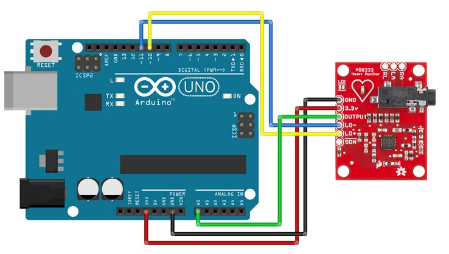
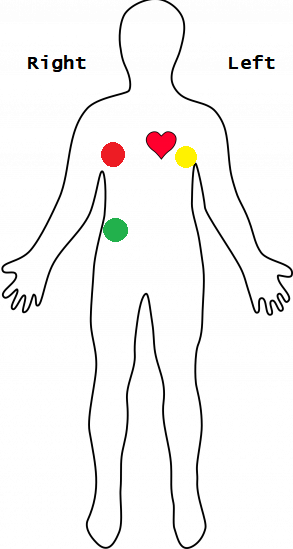

# ECG con Arduino y AD8232

Este proyecto permite adquirir y visualizar señales de ECG (electrocardiograma) usando una placa Arduino y un módulo AD8232. Los datos se leen desde el Arduino, se envían por puerto serie a una computadora, y se visualizan en tiempo real en una interfaz gráfica programada en Python (PyQt).

---

## 📦 Requisitos

### Hardware
- Arduino UNO, MEGA o ESP32
- Módulo AD8232
- Cables Dupont
- Electrodos adhesivos ECG
- PC con puerto USB

### Software
- Arduino IDE
- Python 3.8 o superior

### Librerías de Python
- `pyserial`
- `PyQt5`
- `pyqtgraph`
- `numpy`

## 💻 Configuración de la computadora

1. **Chequear que Python 3.8 o superior esté instalado**  
   (Verificá con `python --version` o `python3 --version` en la terminal)

2. **Descargar este repositorio**  
   Cloná o descargá este repositorio desde GitHub:  
   [🔗 Repositorio del proyecto](https://github.com/FranTassara/ECG-arduinoPython)

3. **Crear entorno virtual**

   Abrí una terminal dentro de la carpeta descargada y ejecutá:

   ```bash
   python -m venv .venv
   ```

4. **Activar el entorno virtual**

   - En Windows:
     ```bash
     .venv\Scripts\activate
     ```
   - En Linux/Mac:
     ```bash
     source .venv/bin/activate
     ```

   Deberías ver el prefijo `(.venv)` al inicio de la línea en la terminal.

5. **Instalar dependencias**

   ```bash
   pip install -r requirements.txt
   ```

6. **Ejecutar la interfaz gráfica**

   ```bash
   python python/main_gui.py
   ```

   ¡La GUI debería abrirse!

---

## ⚙️ Configuración del Arduino y el AD8232
1. Abrí el archivo `arduino/ecg_stream_ad8232.ino` con el Arduino IDE.
2. Seleccioná la placa (Arduino UNO, MEGA o ESP32) y el puerto correcto.
3. Cargá el código a la placa.
4. Realizá las conexiones según el siguiente esquema:
 
   <p align="center">
     
   </p>

---

## ⚡ Colocación de electrodos en el cuerpo

1. Limpiá con alcohol la piel donde se colocarán los electrodos.
2. Colocá los electrodos siguiendo el siguiente esquema:

   <p align="center">
     
   </p>

---

## 🖥️ Interfaz gráfica (GUI)

La GUI tiene los siguientes botones:

- **Conectar**: Establece la conexión con el Arduino (ajustar el puerto en `serial_handler.py` si es necesario).
- **Iniciar**: Envía un handshake al Arduino para comenzar a recibir datos.
- **Detener**: Detiene la adquisición de datos.
- **Guardar**: Guarda los datos en un archivo `.csv`.
